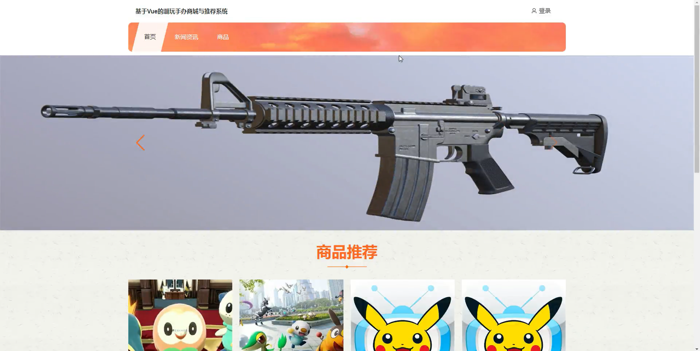
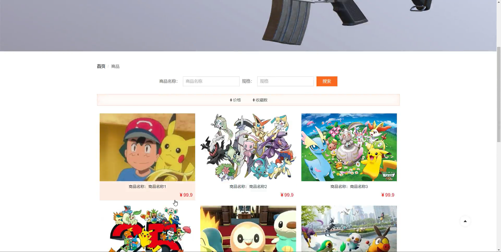
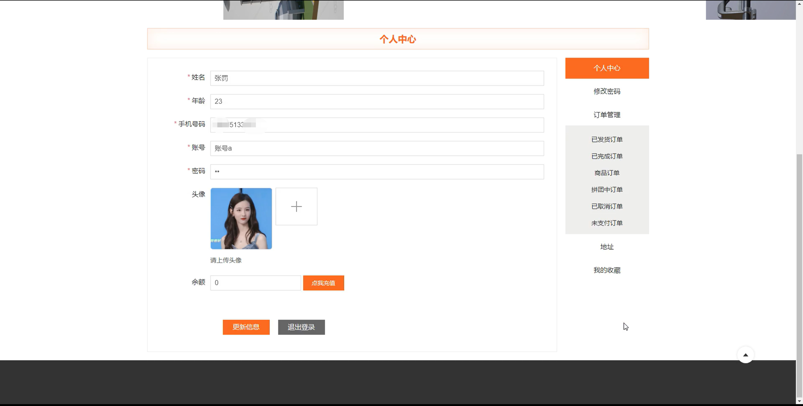
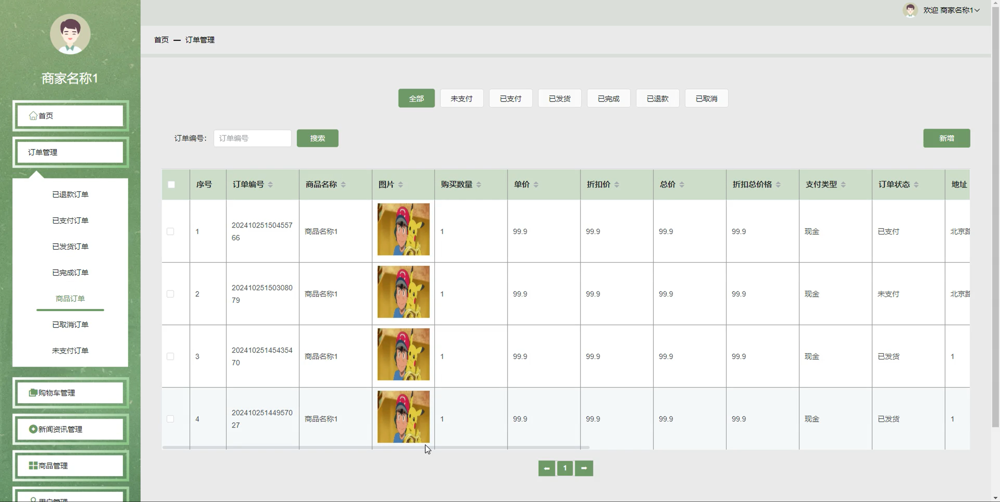
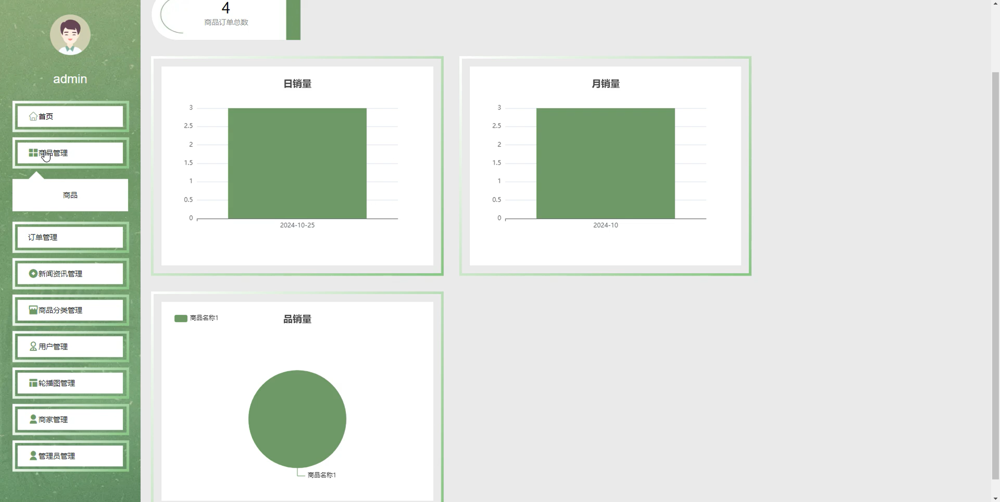
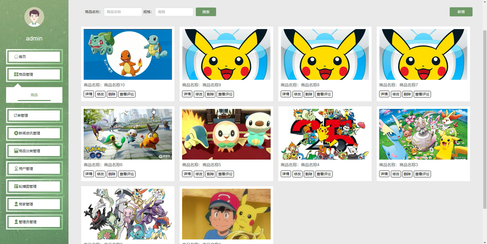
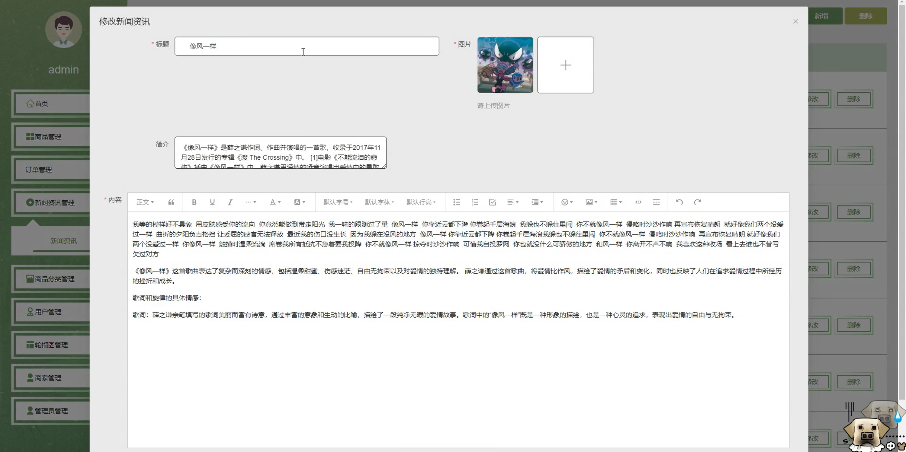

# springbootA436D
springbootA436D潮玩手办商城与推荐系统
 
## 查看主页获取源码

### 一、关键词
手办商品管理、手办订单管理、手办购物车管理

### 二、作品包含
源码+数据库+全套环境和工具资源+本地部署教程

### 三、项目技术
前端技术：Html、Css、Js、Vue3.0、Element-plus 
后端技术：Java、SpringBoot3.0、MyBatis

### 四、运行环境（以下版本亲测，其他版本未知，请自测）
开发工具：IDEA/eclipse  + VSCODE

数据库：MySQL5.7（最低要5.7版本）

数据库管理工具：Navicat10以上版本

环境配置软件： JDK17 + Maven3.6.3

前端Nodejs：20

浏览器：谷歌浏览器

### 五、项目介绍
项目编号：springbootA436D

潮玩手办商城用于集中展示、销售各类潮玩手办，为用户提供购买渠道，提升用户购物效率与商城销售转化。

角色：管理员、用户、商家

管理员：首页、商品管理、订单管理、新闻资讯管理、商品分类管理、用户管理、轮播图管理、商家管理、管理员管理。

用户：首页、新闻资讯、商品、个人中心、修改密码、订单管理、地址、我的收藏。

商家：首页、订单管理、购物车管理、新闻资讯管理、商品管理、用户管理。

### 六、运行截图

